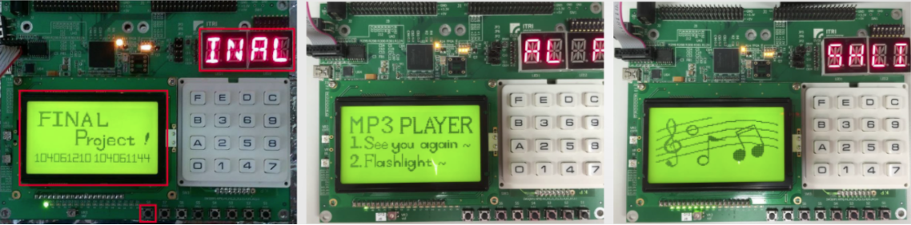

# FPGA Implementation - MP3 player
In this project, I use Verilog to design a MP3 player on FPGA, which includes 14-segment display, keypad control, LCD display, speaker, button, and so on.  
It is controlled by pressing keypads and the menu would appear on the LCD with song name and the 14-segment display.

